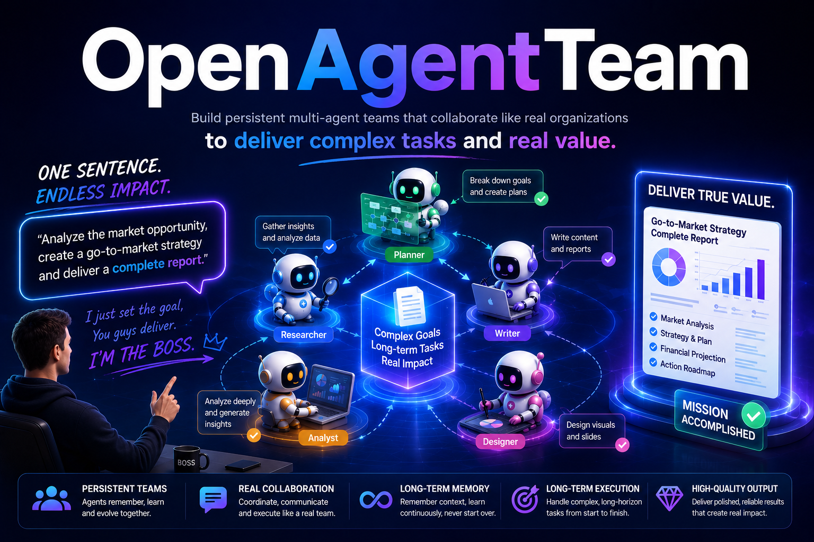

<p align="center">
  
</p>

<h1 align="center">Open Agent Team</h1>

<p align="center">
  Ready-to-install multi-agent teams for OpenCode. Pick a team, install it into a project, and start with <code>@team_lead_agent</code>.
</p>

<p align="center">
  <a href="README.zh-CN.md">中文</a> | <a href="#quick-start">Quick Start</a> | <a href="#teams">Teams</a> | <a href="#what-you-get">What You Get</a>
</p>

---

Open Agent Team is a library of reusable multi-agent teams. Each team packages role prompts, shared quality protocols, delivery standards, and optional skills for one complete workflow.

The goal is simple: make advanced multi-agent collaboration usable in one command.

```text
choose a team -> install it into your project -> open OpenCode -> ask @team_lead_agent
```

## Why Use It

- **One-command installation**: install a complete team into any OpenCode project.
- **Complete deliverables**: teams are designed to produce finished output packages, not loose chat notes.
- **Reliable workflows**: shared protocols define quality gates, source tracing, review loops, and final delivery checks.
- **Reusable team library**: use built-in teams or register your own local team directory.
- **OpenCode-native layout**: installs agents, protocols, skills, `AGENTS.md`, and `opencode.json` into `.opencode/`.

## Quick Start

From this repository root:

```bash
python -m pip install -e .
agent_team list
```

Install a team into your project:

```bash
agent_team install --name ppt_writer_team --path /path/to/your/project
```

Open that project with OpenCode and ask:

```text
@team_lead_agent Create a 15-slide investor deck from the materials in ./materials.
```

The installer creates:

```text
/path/to/your/project/.opencode/
  AGENTS.md
  opencode.json
  agents/
  protocols/
  skills/
```

## What You Get

### Editable PowerPoint Decks

`ppt_writer_team` turns source materials, templates, notes, spreadsheets, PDFs, and public research into a complete PowerPoint package:

- `delivery/final_deck.pptx`: editable `.pptx`, not a static image deck.
- `delivery/speaker_notes.md`: presenter notes and talk track.
- `delivery/source_trace.md`: source trace for claims and data.
- `deck_spec/deck_spec.json`: structured deck plan for review and regeneration.

The team can also extract visual style from an existing PPT template while avoiding unrelated template content reuse.

### Paper Surveys You Can Actually Use

`paper_survey_team` helps with research direction surveys, daily paper radar, and single-paper deep reads:

- ranked paper lists with why each paper matters;
- clear metadata, authors, institutions, years, links, and reading priority;
- method lineage, benchmark evolution, key labs, representative people, and unresolved problems;
- single-paper reports covering background, contribution, method, experiments, limitations, and follow-up reading.

The output is built for scanning, filtering, and deciding what to read next.

### Engineering-Ready Reviews And Plans

Engineering teams produce practical artifacts:

- code review findings ordered by severity;
- test plans, unit tests, integration tests, and edge cases;
- bug triage reports with reproduction plans, root-cause hypotheses, fix options, and verification plans;
- architecture maps, ADR-ready design notes, API/data model plans, and implementation roadmaps.

## Teams

| Team | Use it for | Typical deliverables |
| --- | --- | --- |
| `ppt_writer_team` | Editable presentations from materials, templates, and research | `.pptx`, speaker notes, source trace, deck spec |
| `paper_survey_team` | Literature surveys, paper radar, and paper deep reads | ranked paper lists, survey report, lineage map, reading path |
| `paper_writing_team` | Academic writing, related work, manuscript revision, rebuttal | manuscript sections, literature synthesis, review notes, rebuttal strategy |
| `grant_proposal_team` | Grant proposal packages | proposal, specific aims, budget justification, compliance checklist |
| `story_team` | High-quality short story creation with revision loops | final story, critique notes, revision trace |
| `course_creator_team` | Course and lesson package creation | syllabus, lesson plans, assignments, quiz bank, teacher script |
| `business_plan_team` | Business plans and pitch narratives | business plan, pitch narrative, financial assumptions, risk register |
| `job_application_team` | Resume, cover letter, outreach, interview prep | tailored resume, cover letter, outreach, interview prep |
| `code_review_team` | Findings-first code review | review findings, risk summary, test gaps, suggested fixes |
| `test_generation_team` | Test design from code, bugs, or requirements | test plan, unit tests, integration tests, edge cases |
| `bug_triage_team` | Logs, stack traces, and issue diagnosis | triage report, reproduction plan, root-cause hypotheses, verification plan |
| `codebase_onboarding_team` | Understanding unfamiliar repositories | onboarding guide, architecture map, key files, quickstart |
| `software_architect_team` | Requirements-to-architecture planning | requirements breakdown, architecture, API/data model, roadmap |
| `iphone_app_team` | iPhone app product/design/engineering handoff | product scope, IA, design system, iOS architecture, QA handoff |
| `skills_evolving_team` | Skill design, evaluation, and improvement | reusable skills, evaluation rubric, iteration report |
| `team_creator` | Create new installable agent teams | new team directory, agents, protocols, skills, validation report |

List teams at any time:

```bash
agent_team list
agent_team list --verbose
agent_team list --json
```

## Install Options

Install into the current directory:

```bash
agent_team install --name code_review_team
```

Preview without writing files:

```bash
agent_team install --name code_review_team --path /path/to/project --dry-run
```

Clean generated OpenCode team files before reinstalling:

```bash
agent_team install --name code_review_team --path /path/to/project --clean
```

`--clean` removes generated `.opencode/agents`, `.opencode/protocols`, and `.opencode/skills`. It keeps other files in `.opencode`.

## How It Works

Most teams follow this layout:

```text
teams/<team_name>/
  README.md
  agents/
    team_lead_agent.md
    *_agent.md
  protocols/
    quality_protocol.md
    delivery_protocol.md
    skill_registry.md
  skills/
    <skill_name>/
      SKILL.md
```

During installation:

```text
agents/*.md      -> .opencode/agents/
protocols/*.md   -> .opencode/protocols/
skills/*         -> .opencode/skills/
```

The installer also writes `.opencode/AGENTS.md` and merges `.opencode/opencode.json` so OpenCode loads the team guidance automatically.

## Add Your Own Team

Create a team directory:

```text
my_team/
  README.md
  agents/team_lead_agent.md
  protocols/quality_protocol.md
  protocols/delivery_protocol.md
  protocols/skill_registry.md
  skills/
```

Register it:

```bash
agent_team add --name my_team --path /path/to/my_team
agent_team install --name my_team --path /path/to/project
```

Update or remove it later:

```bash
agent_team update --name my_team --path /new/path/to/my_team
agent_team remove --name my_team
```

## Reliability Principles

- Teams use a `team_lead_agent` as the default coordinator.
- Protocols define mandatory quality and delivery rules.
- Skills provide task-specific methods and scripts.
- Deliverables are named and structured so they can be reviewed, regenerated, or handed off.
- Source-heavy teams emphasize traceability and evidence cards instead of unsupported claims.

## License And Notices

This project is released under the MIT License. See [LICENSE](LICENSE).

Some bundled skills are adapted from third-party open-source repositories and remain subject to their original licenses. See [NOTICE](NOTICE) and [THIRD_PARTY_LICENSES](THIRD_PARTY_LICENSES/) for attribution and bundled license texts.
